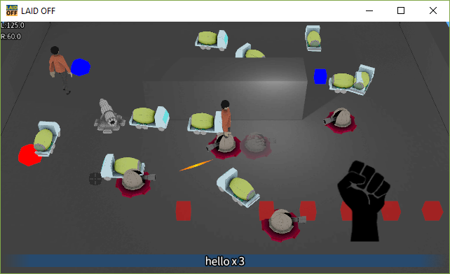

# README #

Private toy project

### What is this repository for? ###

Just playing around...

### How do I get set up? (Client on Windows) ###

1. Install Visual Studio 2017 Community (with C++ support)
2. Install CMake
3. Clone this repository on `C:\laidoff`
4. Open command prompt
5. Execute: `cd c:\laidoff && mkdir build && cd build && cmake ..`
6. Open `client.sln` generated at `C:\laidoff\build`
7. Rebuild all
8. Set `laidoff` as StartUp Project
9. Run!

### How do I get set up? (Server on Linux) ###

#### laidoff-server ####

1. Execute: `mkdir build-server && cd build-server`
2. Execute: `CXXFLAGS=-static cmake .. -DSERVER_ONLY=1`
3. Execute: `make`

#### db-server, match-server, rank-server, reward-server, push-server ####

0. Setup GOPATH properly
1. Execute: `./batch-build-go-servers.sh`

### Diagrams ###

